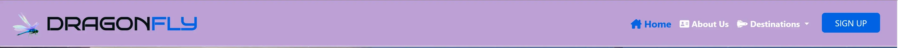

# DragonFly

[image of web on different devices]()

* DragonFly is a space travel website that allows users to book trips, destinations, to Moons and/or Planets.
The website design is responsive so it can be used on any device.

* This is my Milestone Project 1. This website uses technologies that I have learned including HTML, CSS.

## Live Project

[View the live project here.]()

## Repository

[Find the project repository here.]()

# Table of Contents

## Contents
- [User Experience (UX)](#user-experience)
  * [User Stories](#user-stories)
    + [Users](#users)
    + [Buisness Owner](#buisness)
- [Design](#design)
  + [Overview](#overview)
  + [Colour Scheme](#colour-scheme)
  + [Typography](#typography)
  + [Wireframes](#wireframes)
  + [Icons](#icons)
  + [Cards](#cards)
- [Wireframes](#wireframes)
- [Features](#features)
  + [All Pages Features](#all-pages-features)
  + [Index Page Features](#index-page)
  + [Register/ Log In Pages Features](#-register-log-in-pages-features)
- [Future Features](#future-features)
  + [User Experience Features](#user-experience-features)
  + [Development Features](#development-features)
- [Data Model](#data-model)
- [Technologies used](#technologies-used)
  + [Languages Used](#languages-used)
  + [Frameworks Libraries and Programs](#frameworks-libraries-and-programs)
- [Credits](#credits)
  + [Code](#code)
  + [Media](#media)
  + [Content](#content)
  + [Acknowledgements](#acknowledgements)

# User Experience (UX)

## User Stories

### Users

* As a user, I want the landing page of the website to explain the purpose of the website, as well as being able, to go where, access the next steps, as simple and quick as possible.

* As a user I want to be able to navigate the site easily to find information I may require.

* As a user, I want the website to work and be accesible on any device.

### Buisness Owner

* As a Owner, I want it to be as easy and fast as possible for users to choose their destinations, as well as getting the necessary information regarding their choices.

* To allow the users to to be able to contact the DragonFly either for questions or with recommendations.

* I want the website to function and look good on any device.

# Design

## Overview

- The website design is, colorful, inviting and easy to use. The name ‘DragonFly’ refers to the, delicated, colorful, fast flying insect that served as inspiration.

[home-page](docs/assets/reademe-images/navbar.webp)

## Colour

  * The website uses a palette of colours taken from the logo image. The colour palette was created using the [Coolors]("https://coolors.co/") website. 
  It uses a simple colour scheme of wisteria, columbia-blue and magenta with pops of dark-blue and red.

## Typography

  Google Fonts was used for the following fonts:
  * Bruno Ace Sc : was used for the logo at the navbar.
  * Ubuntu: was used for the headings
  * Oswald: was used for the paragraphs, small texts and spans.
  * Sans-serif: used as the fallback font.

## Wireframes
Wireframes were created for the main pages.

 [Home Page](docs/assets/reademe-images/home-page.png)

 [About Us Page](docs/assets/reademe-images/about-us-page.png)

 [Destination Page](docs/assets/reademe-images/about-us-page.png)
 

## Icons

- I have used icons from [Font Awesome]("https://fontawesome.com/icons") on the navbar, about us, and destinations to enhance the text, get more attention. 

# Features

## All Pages Features

### Home Page
#### Navbar

- The nav bar contains the logo, home button, about us, destinations and a sign up button.

- The logo links back to the home page.

- The nav bar turns into a slide-out menu on smaller screen sizes

#### Carousel

### Footer 

- The footer includes the website’s name and a brief description. 

- It also features icons with links out to social media. These windows open in a new tab.

## Index Page

- The purpose of the Silver Spoon website main page is to give a brief description of what the site is about.

- There are big card images on the page, making the next step clear and easy to the user.

###  gghhg

- To give quick visual attraction and simple direction as to where it leads.

## gghjh

- The Register form features input fields for Username, First Name, Last Name and Password. All fields are required.

- The Log in form features input fields for Username and Password. All fields are required.

# Technologies Used

## Languages Used

- [HTML5](https://en.wikipedia.org/wiki/HTML5)

- [CSS3](https://en.wikipedia.org/wiki/CSS)

## Frameworks Libraries and Programs

- [Bootstrap CSS](https://bootstrap.com/)
  - Front-end library with HTML and CSS. I used features including Nav bar, Cards, Buttons, Forms, Grid, Modal.

- [Google Fonts](https://fonts.google.com/)
  - Two fonts are imported from google fonts.
  
- [Font awesome](https://fontawesome.com/)
  - I used icons from font awesome on buttons.

- [Git](https://git-scm.com/)
  - Git was used as a version control in the terminal.

- [Github](https://github.com/)
  - Github was used to create and store the project repository.

- [Gitpod](https://gitpod.io/)
  - Gitpod was used to create my files and where I wrote the code.

- [Google Chrome Dev Tools](https://developer.chrome.com/docs/devtools/)
  - Google Chrome's Dev Tools were used while building the project to test responsiveness and for debugging.

# Testing
  - 

# Credits

## Code

- Bootstrap: I used this library throughout the project. Particularly for the nav bar, cards, forms, buttons, grid and modals.

- Code Institute: I referred to lessons and source code from Code Institute's Web Application Development course. I sourced the Beyond Bootstrap, Love Running, from the Walk Through Projects, as inpiration for the modals, nav, dropdown buttons.

- W3Schools: I referred to guides on [CSS Images](https://www.w3schools.com/python/python_mongodb_getstarted.asp), [CSS Dropdowns](), [CSS Grid]().

## Content

- Pexel Images - Images sourced from [Pexel Images]()

## Media

- 

## Acknowledgements

- Thank you to my Mentor Aline Roche for helpful feedback, industry insights and recommended tools.

- Thank you to Christopher Undritz for participating in the peer code review on the Code Institute Slack channel. Thank you to my family for manually testing the website and for feedback.

- Thank you to the Code Institute London Community for their encouragement and technical support.

- Thank you to the tutors and staff at Code Institute for their support.

- 
---

Esmael Pinho
2023
