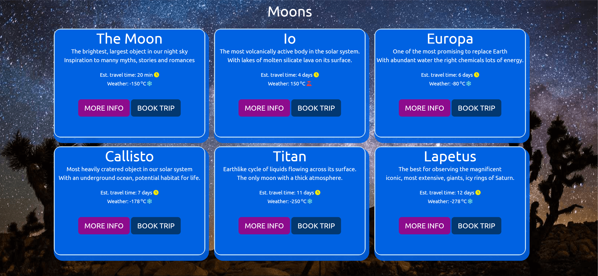
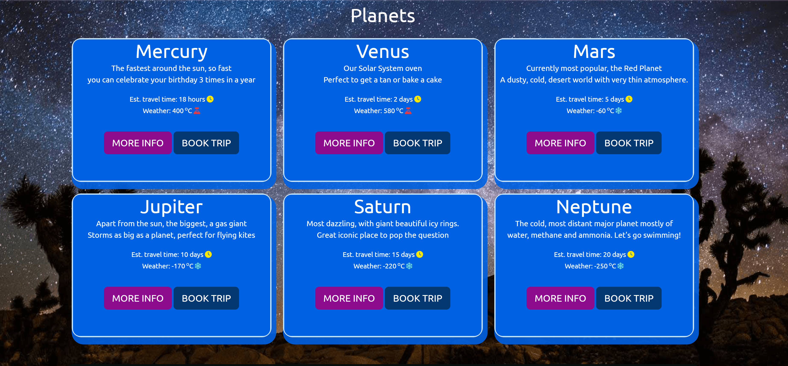

# DragonFly

[image of web on different devices]()

* DragonFly is a space travel website that allows users to book trips, destinations, to Moons and/or Planets.
The website design is responsive so it can be used on any device.

* This is my Milestone Project 1. This website uses technologies that I have learned including HTML, CSS.

## Live Project

[View the live project here.]()

## Repository

[Find the project repository here.]()

# Table of Contents

## Contents
- [User Experience (UX)](#user-experience)
  * [User Stories](#user-stories)
    + [Users](#users)
    + [Buisness Owner](#buisness)
- [Design](#design)
  + [Overview](#overview)
  + [Colour Scheme](#colour-scheme)
  + [Typography](#typography)
  + [Wireframes](#wireframes)
  + [Icons](#icons)
  + [Cards](#cards)
- [Wireframes](#wireframes)
- [Features](#features)
  + [All Pages Features](#all-pages-features)
    + [Home Page](#home-page)
      + [Navbar](#navbar)
      + [Hero Carousel](#hero-carousel)
      + [Quotes](#quotesl)
      + [Subscribe Section](#subscribe-section)
      + [Footer](#footer)
    + [About Us Page](#about-us-page)
    + [Destinations Page](#destination-page)
      + [Moons and Planets](#moons-and-planets)
        + [Moon Cards](#moon-cards)
        + [Planet Cards](#planet-cards)
        + [Cards Info](#cards-info)
- [Technologies used](#technologies-used)
  + [Languages Used](#languages-used)
  + [Frameworks Libraries and Programs](#frameworks-libraries-and-programs)
- [Deployment](#deployment)
  + [How To Fork](#how-to-fork)
  + [How To Clone](#how-to-clone)
- [Testing](#testing)
  + [W3C Validator](#w3c-validator)
  + [Lighthouse](#lighthouse)
- [Credits](#credits)
  + [Code](#code)
  + [Content](#content)

# User Experience (UX)

## User Stories

### Users

* As a user, I want the landing page of the website to explain the purpose of the website, as well as being able, to go where, access the next steps, as simple and quick as possible.

* As a user I want to be able to navigate the site easily to find information I may require.

* As a user, I want the website to work and be accesible on any device.

### Buisness Owner

* As a Owner, I want it to be as easy and fast as possible for users to choose their destinations, as well as getting the necessary information regarding their choices.

* To allow the users to to be able to contact the DragonFly either for questions or with recommendations.

* I want the website to function and look good on any device.

# Design

## Overview

- The website design is, colorful, inviting and easy to use. The name ‘DragonFly’ refers to the, delicated, colorful, fast flying insect that served as inspiration.

[home-page](docs/assets/readme-images/navbar.webp)

## Colour

  * The website uses a palette of colours taken from the logo image. The colour palette was created using the [Coolors]("https://coolors.co/") website. 
  It uses a simple colour scheme of wisteria, columbia-blue and magenta with pops of dark-blue and red.

## Typography

  Google Fonts was used for the following fonts:
  * Bruno Ace Sc : was used for the logo at the navbar.
  * Ubuntu: was used for the headings
  * Oswald: was used for the paragraphs, small texts and spans.
  * Sans-serif: used as the fallback font.

## Wireframes
Wireframes were created for the main pages.

 [Home Page](docs/assets/readme-images/home-page.png)

 [About Us Page](docs/assets/readme-images/about-us-page.png)

 [Destination Page](docs/assets/readme-images/about-us-page.png)
 

## Icons

- I have used icons from [Font Awesome]("https://fontawesome.com/icons") on the navbar, about us, and destinations to enhance the text, get more attention. 

# Features

## All Pages Features

### Home Page
#### Navbar

- The nav bar contains the logo, home button, about us, destinations and a sign up button.

- The logo links back to the home page.

- The nav bar turns into a slide-out menu on smaller screen sizes

#### Hero Carousel

Hero carousel shows informative text about the pourpose of the site, and it's different pages, it also has buttons that allow the user to quickly find what it's looking for.

#### Quotes

Users comentary, of what they feel thought of the experience with [DragonFly]().

Pictures to help attract possible new users, what others have been experiencing, memories we help them create.

 #### Subscribe Section

Small part of the page that allows the user to subscribe, in order to receive updates regarding more available destinations.

#### Footer 

The footer's the same for all the pages and includes the website’s name and a brief description. 

It also features icons with links out to social media. These windows open in a new tab.

 ### About Us Page

This page provides curiosity information regarding the Website, how it came to be, it's history and mission.
  
  
Contact us section that allow the user to leave a comment, ask some questions, or even make a special visit.
  

### Destinations 
#### Moons and Planets
#### Moon Cards

#### Planet cards

The card section on the Moons and Planet page, contains six cards that has a hover animation, rotating 180deg showing some descriptive text about it's moon.

The cards have two buttons that allow the user, either to be able to book a destination, that provides some extra information.

#### Cards Info

Some possibe new curiosity about the Moon/Planet, that may help increase the want to visit on the user.

# Technologies Used

## Languages Used

- [HTML5](https://en.wikipedia.org/wiki/HTML5)

- [CSS3](https://en.wikipedia.org/wiki/CSS)

## Frameworks Libraries and Programs

- [Bootstrap CSS](https://getbootstrap.com/docs/5.3/getting-started/introduction/)
  - Front-end library with HTML and CSS. I used features including Nav bar, Cards, Buttons, Forms, Grid, Modal.

- [Google Fonts](https://fonts.google.com/)
  - Two fonts are imported from google fonts.
  
- [Font awesome](https://fontawesome.com/icons)
  - I used icons from font awesome on buttons.

- [Git](https://git-scm.com/)
  - Git was used as a version control in the terminal.

- [Github](https://github.com/)
  - Github was used to create and store the project repository.

- [Gitpod](https://gitpod.io/)
  - Gitpod was used to create my files and where I wrote the code.

- [Google Chrome Dev Tools](https://developer.chrome.com/docs/devtools/)
  - Google Chrome's Dev Tools were used while building the project to test responsiveness and for debugging.

- [Am I Responsive?](http://ami.responsivedesign.is/) 
  - To show the website image on a range of devices.

- [Figma](https://www.figma.com/?fuid=)
  - Figma was used to help create the inicial idea for the website.

- [Image Resizer](https://imageresizer.com/)
  - Image Resizer was used to resize the images, as well as change it's format.

- [TinyPNG](https://tinypng.com/)
  - TinyPNG was used to compress images, making it smaller to help with loading speed.

- [Coolors](https://coolors.co/)
  - Coolors was used to help generate the color palettes used on the Website.

- [Google Images](https://images.google.co.uk/)
  - Google Images, used to obtain images used.

- [Pexels](https://www.pexels.com/)
  - Pexels was used to obtain images used on the Website

# Deployment
Github Pages was used to deploy the live website. The instructions to achieve this are below:

1. Log in (or sign up) to Github.
2. Find the repository for this project,.
3. Click on the Settings link.
4. Click on the Pages link in the left hand side navigation bar.
5. In the Source section, choose main from the drop down select branch menu. Select docs/ from the drop down select folder menu.
6. Click Save. The live website site is now deployed at the URL showned at the top by Github pages.

#### How to Fork

To fork the DragonFly repository:

1. Log in (or sign up) to Github.
2. Go to the repository for this project,.
3. Click the Fork button in the top right corner.

#### How to Clone

To clone the DragonFly repository:

1. Log in (or sign up) to GitHub.
2. Go to the repository for this project, .
3. Click on the code button, select whether you would like to clone with HTTPS, SSH or GitHub CLI and copy the link shown.
4. Open the terminal in your code editor and change the current working directory to the location you want to use for the cloned directory.
5. Type 'git clone' into the terminal and then paste the link you copied in step 3. Press enter.

# Testing

### W3C Validator

The W3C validator was used to validate the HTML on all pages of the website. It was also used to validate CSS in the style.css file.

* [Index Page]()
* [About Us Page]()
* [Moons Page]()
* [Planets Page]()
* [style.css CSS]()

### Lighthouse

I used Lighthouse within the Chrome Developer Tools to allow me to test the performance, accessibility, best practices and SEO of the website.

#### Index Page

#### About Us Page

#### Moons Page

#### Planets Page

### Full Testing

To fully test my website I performed the following testing using a number of browsers (Google Chrome, Edge, Firefox) and devices.

Links.

1. Tested each link on the index page. Each link worked as expected, and any links leading to external pages opened correctly in a seperate browser tab.

# Credits

## Content

- Hero Carousel #1 - Images sourced from [Pexel Images]()
- Hero Carousel #2 - Images sourced from [Pexel Images]()
- Hero Carousel #3 - Images sourced from [Pexel Images]()
- Hero Carousel #4 - Images sourced from [Pexel Images]()

- Quotes Carousel #1 - Images sourced from [Pexel Images]()
- Quotes Carousel #2 - Images sourced from [Pexel Images]()
- Quotes Carousel #3 - Images sourced from [Pexel Images]()
- Quotes Carousel #4 - Images sourced from [Pexel Images]()
- Quotes Carousel #5 - Images sourced from [Pexel Images]()
- Quotes Carousel #6 - Images sourced from [Pexel Images]()

- Quotes Memories-Left #1 - Images sourced from [Pexel Images]()
- Quotes Memories-Left #2 - Images sourced from [Pexel Images]()
- Quotes Memories-Left #3 - Images sourced from [Pexel Images]()
- Quotes Memories-Left #4 - Images sourced from [Pexel Images]()
- Quotes Memories-Left #5 - Images sourced from [Pexel Images]()
- Quotes Memories-Left #6 - Images sourced from [Pexel Images]()
- Quotes Memories-Left #7 - Images sourced from [Pexel Images]()

- Quotes Memories-Right #1 - Images sourced from [Pexel Images]()
- Quotes Memories-Right #2 - Images sourced from [Pexel Images]()
- Quotes Memories-Right #3 - Images sourced from [Pexel Images]()
- Quotes Memories-Right #4 - Images sourced from [Pexel Images]()
- Quotes Memories-Right #5 - Images sourced from [Pexel Images]()
- Quotes Memories-Right #6 - Images sourced from [Pexel Images]()
- Quotes Memories-Right #7 - Images sourced from [Pexel Images]()

- Moons - Images sourced from [Pexel Images]()
- Moons - Images sourced from [Pexel Images]()
- Moons - Images sourced from [Pexel Images]()
- Moons - Images sourced from [Pexel Images]()
- Moons - Images sourced from [Pexel Images]()
- Moons - Images sourced from [Pexel Images]()

- Planets - Images sourced from [Pexel Images]()
- Planets - Images sourced from [Pexel Images]()
- Planets - Images sourced from [Pexel Images]()
- Planets - Images sourced from [Pexel Images]()
- Planets - Images sourced from [Pexel Images]()
- Planets - Images sourced from [Pexel Images]()

## Code

Bootstrap: I used this library throughout the project. Particularly for the nav bar, cards, forms, buttons, grid and modals.

Code Institute: I referred to lessons and source code from Code Institute's Web Application Development course. I sourced the Beyond Bootstrap, Love Running, CV(resume) from the Walk Through Projects, as inpiration for the modals, nav, history timeline.

W3Schools: I referred to guides on [CSS Images](https://www.w3schools.com/), [CSS Grid](), [CSS Hover]()

Esmael Pinho
2023
